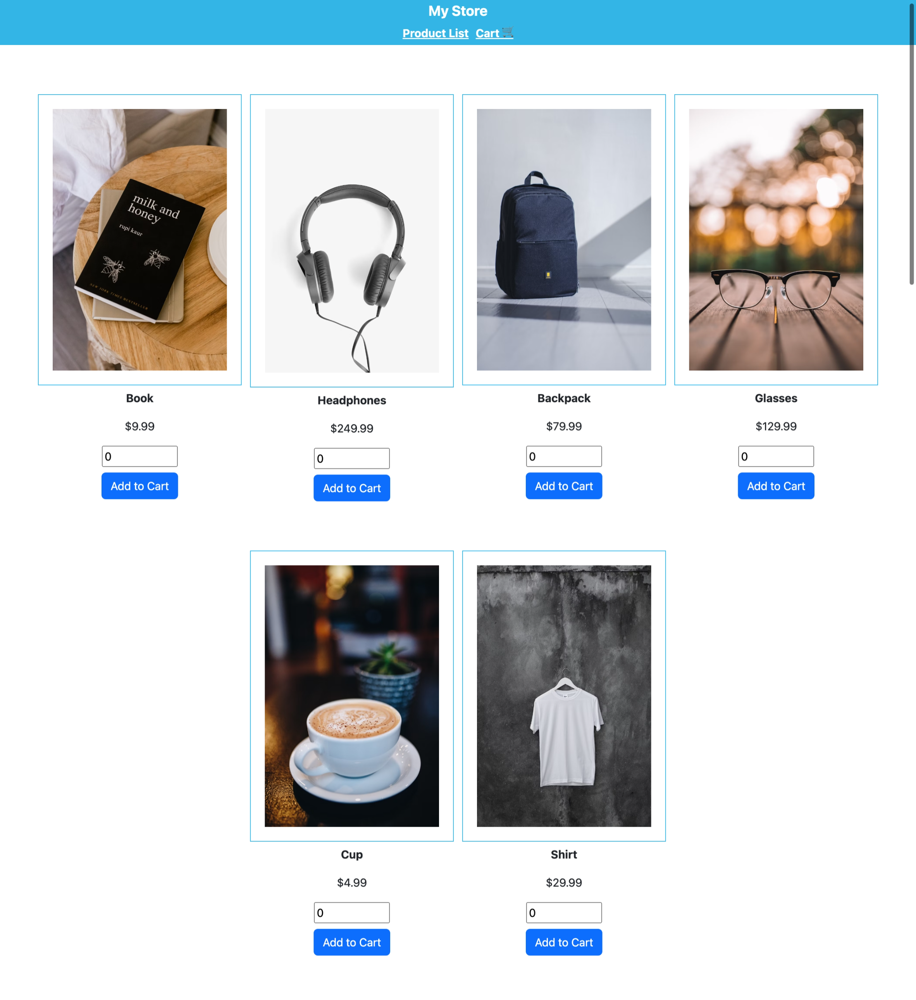
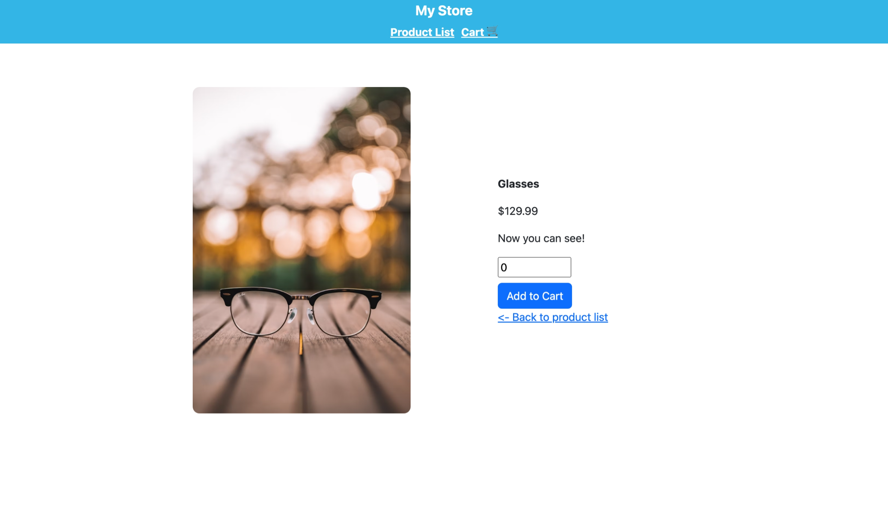
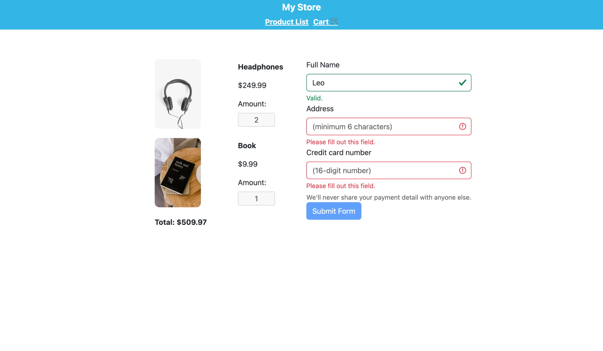

# My Store

## About this App

My Store is a web application that display products with essential information to help users choose which items to explore further and buy it.

### Landing/Product

User can select/input quantity (greater than 0) of products then click `Add to Cart` button to add them to cart. Click the button again with different quantity will update the cart for that item.

Item can be remove from cart by input/select 0 for quantity.

## Product Detail

User can view more detail of the product when they clicking on the product's image in listing page.

### Cart

User can checkout their cart by filling the form and submit.

## Built with

This project was built with [Angular CLI](https://github.com/angular/angular-cli) version 17.3.3 and [Bootstrap](https://getbootstrap.com/docs/5.3/getting-started/introduction/)

## Development server

First, run `npm ci --verbose` to install dependencies.

Then run `ng serve` to start a server, the app will be served at `http://localhost:4200/`.
